# Features

## Single shot

Display real-time images of microscope equipment, capture images of different channels, and analyze the images.

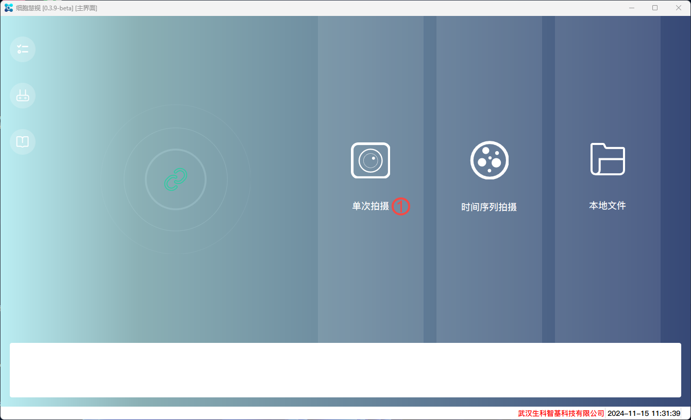

### Preview
Read real-time images from microscope equipment and display them. It can adjust light intensity, exposure time, exposure gain, Z-axis movement, autofocus, ZStack shooting, and other functions.

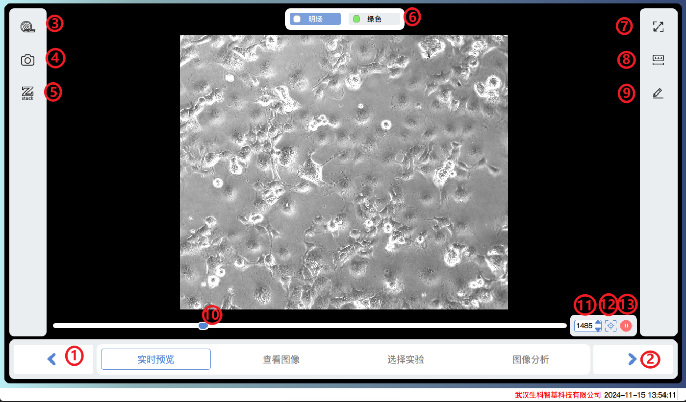
1. Previous step
2. Next step
3. Objective lens switching
4. Picture effect settings and shooting
5. ZStack shooting
6. Light source channel switching
7. Full screen display
8. Scale
9. Scale unit
10. Coarse focusing
11. Fine focusing
12. Auto focus
13. Stop autofocus

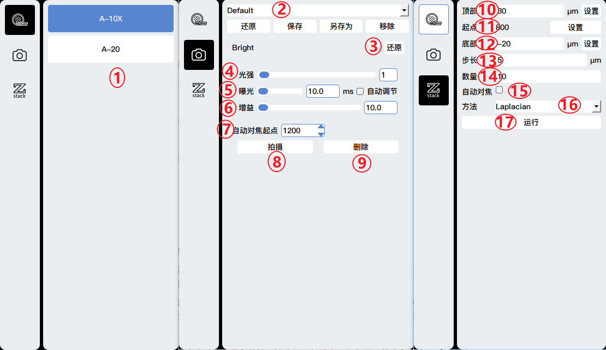
1. Objective lens switching
2. Template settings, adding, saving, deleting shooting parameter settings templates, switching between different templates to restore the settings of this template.
3. Restore settings
4. Light intensity adjustment
5. Exposure time adjustment
6. Exposure gain adjustment
7. Set the starting point for autofocus
8. Shooting
9. Delete the current shot
10. Distance upwards relative to the starting point
11. Starting point
12. Distance downwards relative to the starting point
13. Step size, distance of each step
14. Total number of shots taken
15. Whether to select autofocus first
16. Methods for Depth of Field Expansion
17. Run ZStack to shoot

### View Image
View the captured image and adjust the image effect.

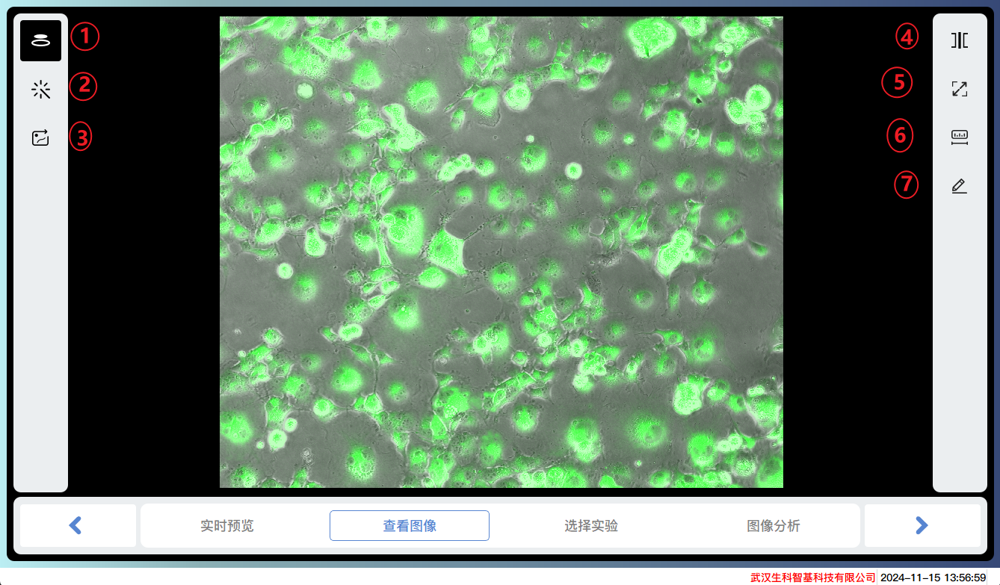

1. Adjustment of image effects for each channel
2. Preview of Image Preprocessing Effects
3. Export image files/videos
4. Multi view display
5. Full screen display
6. Scale bar
7. Scale units

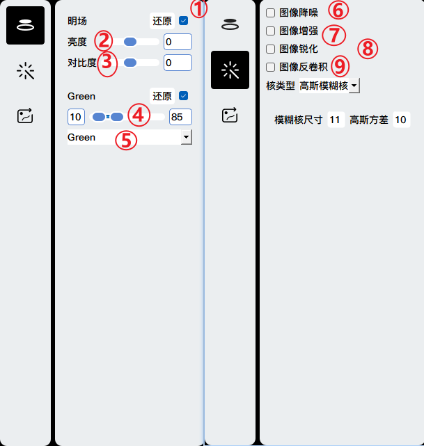
1. Display the channel image
2. Brightness adjustment
3. Contrast adjustment
4. Reduce background to the left and increase brightness to the right
5. Pseudo color selection
6. Image denoising to reduce background noise in the image
7. Image enhancement, enhanced image contrast, and background uniformity
8. Image sharpening enhances the edges of the image, making it clearer
9. Image deconvolution to improve image resolution and signal-to-noise ratio

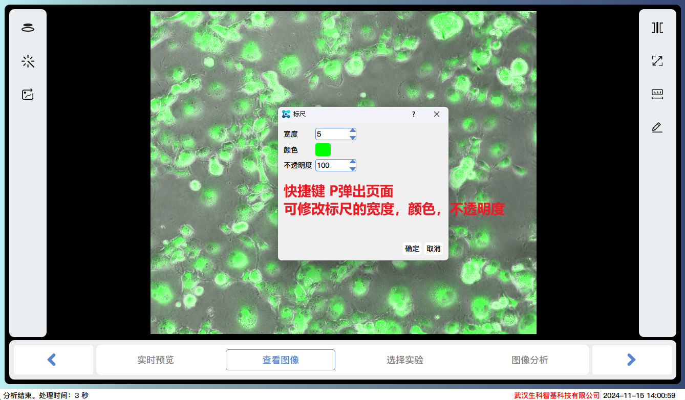
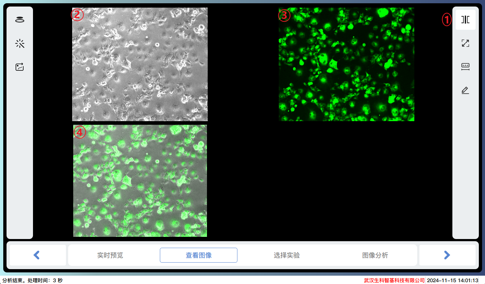
1. Multi view display
2. Bright field image
3. Green fluorescence image
4. Image obtained by superimposing bright field and green fluorescence
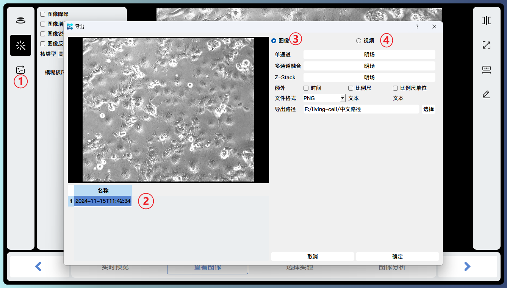

### Choose Experiment
Select an analysis module

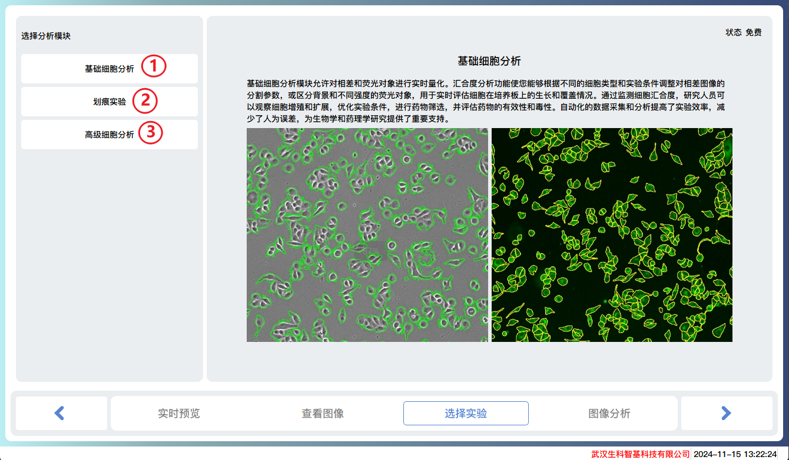

1. Basic cell analysis, using traditional methods to analyze images from different channels, displaying cell masks and related indicator data such as confluence degree, number of cells, fluorescence intensity, area, perimeter, and other indicator information.
2. Scratch analysis, analyzing the scratch areas of different channels, displaying the scratch areas and related indicator data, such as scratch width, cure rate, and other indicator information.
3. Advanced cell analysis, using AI deep learning methods to analyze images from different channels, display cell masks, and related indicator data such as confluence degree, number of cells, fluorescence intensity, area, perimeter, and other indicator information.

### Image Analysis

#### Basic cell analysis

1. Adjustment of analysis parameters for each channel
2. Adjustment of image effects for each channel
3. Mask adjustment
4. Full screen display
5. Scale bar
6. Scale units
7. Analysis of areas of interest

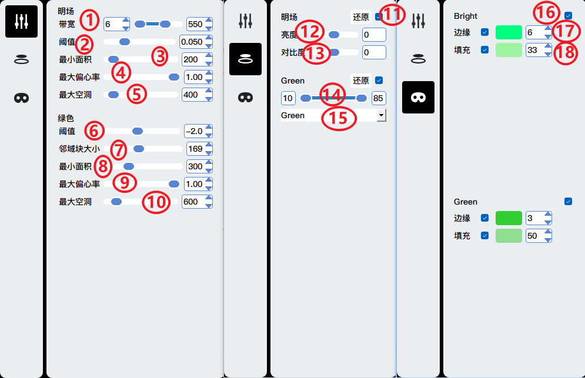
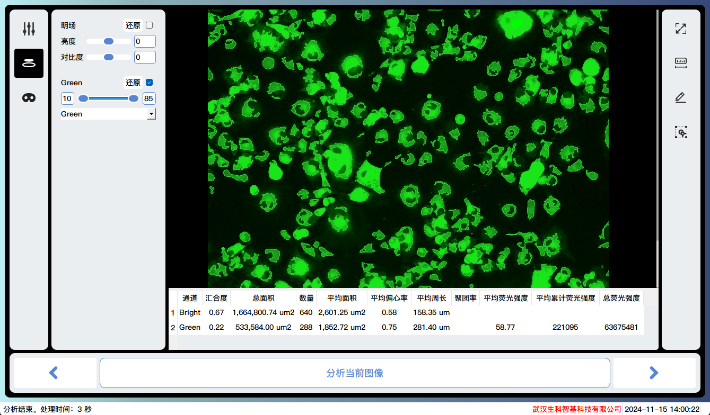
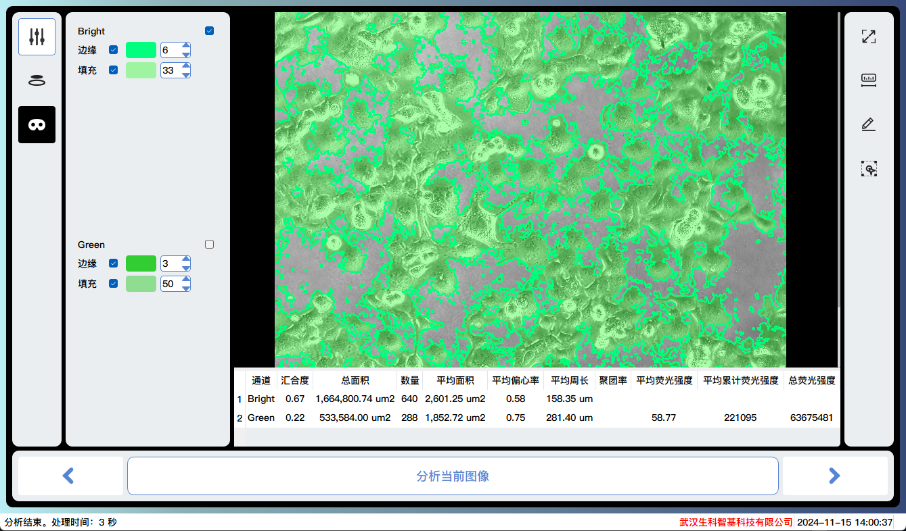

#### Scratch analysis
#### Advanced cell analysis

## Time series shooting

### Preview

### View Image

### Experiment setup

### Experiment schedule

### Experiment running

## Local files

### View File

### View Image

### Choose Experiment

### Image Analysis

### Select Image

