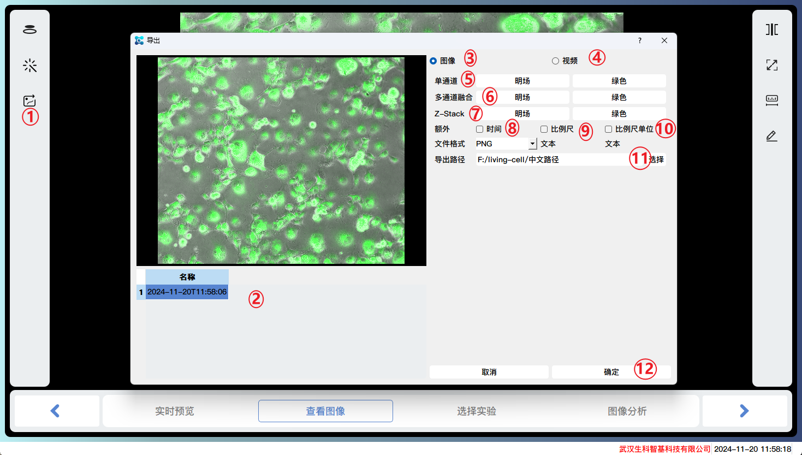

# Features

## Single shot

Display real-time images of microscope equipment, capture images of different channels, and analyze the images.

### Preview
Read real-time images from microscope equipment and display them. It can adjust light intensity, exposure time, exposure gain, Z-axis movement, autofocus, ZStack shooting, and other functions.

1. Previous step
2. Next step
3. Objective lens switching
4. Picture effect settings and shooting
5. ZStack shooting
6. Light source channel switching
7. Full screen display
8. Scale
9. Scale unit
10. Coarse focusing
11. Fine focusing
12. Auto focus
13. Stop autofocus

1. Objective lens switching
2. Template settings, adding, saving, deleting shooting parameter settings templates, switching between different templates to restore the settings of this template.
3. Restore settings
4. Light intensity adjustment
5. Exposure time adjustment
6. Exposure gain adjustment
7. Set the starting point for autofocus
8. Shooting
9. Delete the current shot
10. Distance upwards relative to the starting point
11. Starting point
12. Distance downwards relative to the starting point
13. Step size, distance of each step
14. Total number of shots taken
15. Whether to select autofocus first
16. Methods for Depth of Field Expansion
17. Run ZStack to shoot

### View Image
View the captured image and adjust the image effect.

1. Adjustment of image effects for each channel
2. Preview of Image Preprocessing Effects
3. Export image files/videos
4. Multi view display
5. Full screen display
6. Scale bar
7. Scale units

1. Display the channel image
2. Brightness adjustment
3. Contrast adjustment
4. Reduce background to the left and increase brightness to the right
5. Pseudo color selection
6. Image denoising to reduce background noise in the image
7. Image enhancement, enhanced image contrast, and background uniformity
8. Image sharpening enhances the edges of the image, making it clearer
9. Image deconvolution to improve image resolution and signal-to-noise ratio

1. Multi view display
2. Bright field image
3. Green fluorescence image
4. Image obtained by superimposing bright field and green fluorescence

1. Image/video export
2. Select the image to be exported
3. Export image files
4. Export video files
5. Multiple selection of single channel images
6. Multiple channel images can be stacked and exported
7. Export channel images captured by Z-Stack
8. The exported image comes with relative time
9. The exported image comes with a scale bar
10. Export images with scale units attached
11. Choose the export path
12. Click OK to batch export multiple image files

1. Image/video export
2. Export video files
3. Multiple selection of single channel images
4. Multiple channel images can be stacked and exported
5. The exported video comes with relative time
6. The exported video comes with a scale bar
7. Export videos with scale units attached
8. Choose the export path
9. Click OK to batch export multiple video files

### Choose Experiment
Select an analysis module

1. Basic cell analysis, using traditional methods to analyze images from different channels, displaying cell masks and related indicator data such as confluence degree, number of cells, fluorescence intensity, area, perimeter, and other indicator information.
2. Scratch analysis, analyzing the scratch areas of different channels, displaying the scratch areas and related indicator data, such as scratch width, cure rate, and other indicator information.
3. Advanced cell analysis, using AI deep learning methods to analyze images from different channels, display cell masks, and related indicator data such as confluence degree, number of cells, fluorescence intensity, area, perimeter, and other indicator information.

### Image Analysis

#### Basic cell analysis

1. Adjustment of analysis parameters for each channel
2. Adjustment of image effects for each channel
3. Mask adjustment
4. Full screen display
5. Scale bar
6. Scale units
7. Analysis of areas of interest
8. Analyze the current image

1. Bandwidth: Detail retention. The smaller the l-value, the easier it is to preserve large objects (such as uniform plaque contamination in the image); The larger the right value, the easier it is to preserve small objects (such as random Gaussian noise generated by devices); Suggest selecting the middle value
2. Threshold: Signal threshold. The smaller the value, the easier it is to preserve image details, and vice versa.
3. Eccentricity: Eccentricity screening threshold. The smaller the value, the greater the filtering effect on long or irregular objects, and vice versa.
4. Minimum area: The minimum area of the retained mask. The smaller the value, the easier it is to retain small areas of cells (and also more likely to introduce noise), and vice versa.
5. Maximum Void: The maximum area of a closed void. The larger the value, the larger the closed cavity, and vice versa.
6. Similar to 2.
7. Domain block size: The dynamic segmentation block size of the domain. The smaller the neighborhood block, the easier it is to be sensitive to small objects and recognize local small objects.
8. Similar to 3.
9. Similar to 4.
10. Similar to 5.
11. Display the channel image
12. Brightness adjustment
13. Contrast adjustment
14. Reduce background to the left and increase brightness to the right
15. Pseudo color selection
16. Display and hide the mask of a certain channel
17. Adjust the color and width of the edge lines of the mask
18. Adjust the color and opacity of the filled area

Demonstration of bright channel analysis results:

Demonstration of green fluorescence channel analysis results:

#### Scratch analysis

1. Smoothness: The smaller the size, the smaller the recognition area, and vice versa.
2. Boundary adhesion: The smaller the size, the larger the recognition area, and vice versa.
3. Display the channel image
4. Brightness adjustment
5. Contrast adjustment
6. Reduce background to the left and increase brightness to the right
7. Pseudo color selection
8. Display and hide the mask of a certain channel
9. Adjust the color and width of the edge lines of the mask
10. Adjust the color and opacity of the filled area

Demonstration of bright channel analysis results:

Demonstration of green fluorescence channel analysis results:

#### Advanced cell analysis
Similar to basic cell interfaces and operations, the advantage is higher accuracy.

Demonstration of bright channel analysis results:

Demonstration of green fluorescence channel analysis results:

## Time series shooting
Start the time series shooting task according to the settings.

1. Click to enter the time series shooting task creation process

### Preview
Similar to the real-time preview page in a single shooting process.

### View Image
Similar to the function of viewing image pages in a single shooting process.

### Experiment setup
Set the shooting method of the experimental equipment.

1. The experiment name is also the name of the experimental file
2. Channel selection for shooting, supports up to 4 channels for simultaneous shooting, multiple choices.
3. Objective lens selection, single choice.
4. Whether to enable autofocus
5. Enable ZStack and select one of the depth of field extension methods to merge multiple images into one image.
6. Remarks: Some information can be recorded.
7. Select the analysis module, single choice.
8. Warning reminder: Convergence degree and scratch healing rate warning can be selected. If the set value is exceeded, warning information will be displayed in the form of a dialog box.
9. Warning reminder method, supports sending email messages to your mailbox.
10. Send a test email to your email.

### Experiment schedule
Set the time period for the experiment.

1. According to the total duration: Calculate the number of shots based on the set total duration and interval, and start the shooting task at the start time.
2. According to the time interval: Based on the number of shots and the interval, the shooting task is carried out at the starting time.

### Experiment running

View the intermediate states during the experimental operation.

1. Experimental progress
2. Pause/Resume Experiment
3. Click to open the detailed information of the experiment run
4. The time point at which the shooting has been completed
5. Shooting and analyzing progress, as well as remaining time
6. Stop the experiment (unable to recover)
7. Select the previous image at the selected time point
8. Select the next image at the selected time point

## Local files
View the relevant information of the local experimental files and have the option to perform batch analysis on the images again.

### View File
View relevant information about local experimental files and import external image files.

1. File name
2. File loading status, generally including unloaded, loading, and completed states.
3. Import a single image file
4. Batch import all image files in the directory
5. Previous step
6. Next step
7. Actual shooting time
8. Current image number/total number of shots taken
9. Analysis results
10. Export analysis data to a txt file
11. Remove analysis records (cannot be restored, permanently deleted)

### View Image
Similar to the function of viewing image pages in a single shooting process.

1. Select one of the images

### Choose Experiment
Select a certain analysis module to proceed to the next step of analysis.

### Image Analysis
Similar to the image analysis function in a single shot.

1. Analyze the currently selected image
2. Batch analyze all images
3. Switch current image

### Select Image
Select the image to be analyzed.

1. Select All
2. Select the image to be analyzed
3. The next step is to return to the main interface and start the task of batch analysis.

### Analysis running
Detailed information of the analysis task

1. Task progress
2. Pause/Resume task
3. Click to open the detailed information of the task
4. Analysis progress
5. Stop analysis

## other

### user manual
By right clicking on the title bar and clicking on Help, you can open the user manual, which provides detailed instructions on how to use the software.

