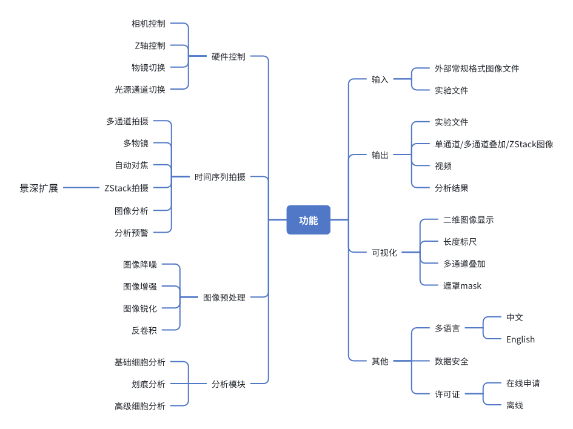
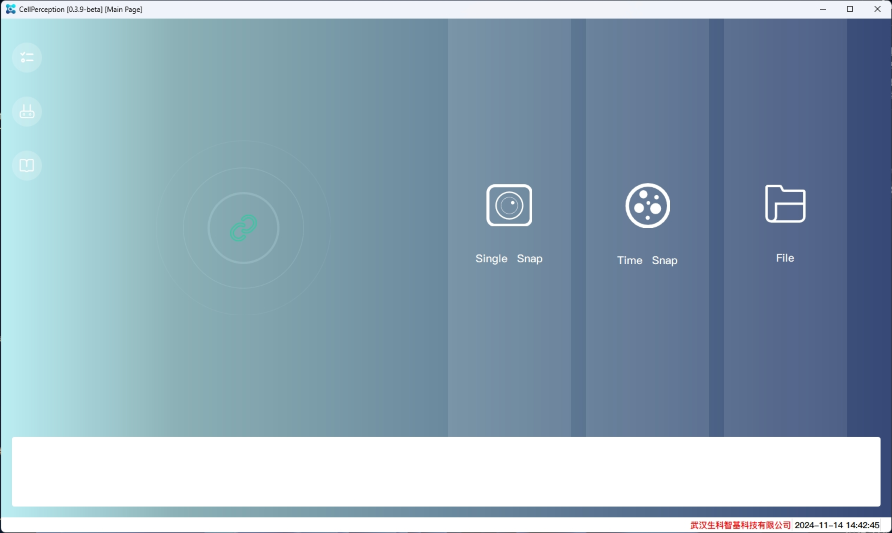

# Introduction

## What is CellPerception

CellPerception software monitors and analyzes cell behavior, morphology, and physiological status in real time, helping researchers gain a deeper understanding of cell dynamics, such as proliferation, migration, and apoptosis, and providing powerful data support for cell biology research and drug screening.
 
 

## Technical features
* Real-time imaging and monitoring: It can continuously monitor cell behaviors such as proliferation, migration, apoptosis, etc. during long-term experiments without interrupting the experimental process and providing real-time data.
 
 

* Automated data analysis: Through advanced image processing and analysis algorithms, it can automatically identify and quantify indicators such as cell morphology, quantity, migration speed, etc., reducing human errors.
 
 

* Non-invasive imaging: Using microscope imaging technology, it can achieve non-invasive monitoring without disturbing the natural state of cells or samples, which is suitable for long-term dynamic observation.
 
 
* Data visualization and report generation: It provides a variety of data visualization options, such as curve charts, heat maps, trajectory charts, etc., and can automatically generate experimental reports for easy result analysis and sharing.
 
 
* Compatible with multiple platforms: It supports compatibility with different models of microscopes and automation equipment, which is easy to integrate into the existing workflow of the laboratory.
 
 

## Application scenarios

* Drug screening and effect evaluation: Real-time monitoring of biological processes such as cell proliferation, death, and migration to help evaluate the effects of candidate drugs, especially in the development of cancer, antiviral and antibacterial drugs.
 
 
* Cell migration and invasion experiments: Through scratch experiments, Transwell migration and other methods, the migration and invasion ability of cells under different conditions are analyzed, which are often used in tumor, immune response and wound repair research.
 
 
* Immune cell function analysis: Monitoring the proliferation, activity and migration of immune cells (such as T cells, B cells, etc.), applied to immunotherapy, vaccine development and immune response mechanism research.
 
 
* Cell stress response and disease research: Real-time analysis of cell responses under conditions such as drugs, chemical stress, and viral infection, helping to discover new disease markers, toxicity assessment and the effect of anti-stress treatment.
 
 

## Main functions

## Main interface

## Supported image formats

* PNG
* JPG, JPEG
* TIFF
* DICOM
* BMP

## Supported microscope equipment

* CellAnalyzer

## License

CellPerception is a commercial software system. Basic modules are free, while advanced modules require payment.