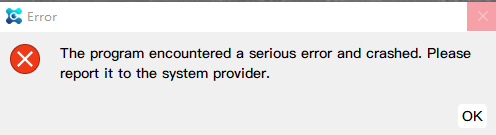

# Note

This chapter mainly introduces some precautions and how to handle unexpected situations when they occur.

If none of the following situations can solve your problem, please contact us promptly.

## Installation
1. Unable to connect the device, possibly due to insufficient USB power supply. If it is a desktop computer, it is recommended to use the USB interface behind the chassis.
2. Installation path, recommended in English.
3. Unable to connect to the device, it may be due to driver not being installed or installation failure. Please check if the firewall is turned off and if there are any errors during the driver installation process.

## First use
1. After entering the main interface, authorization is required for the corresponding module before it can be used.
2. If you need to connect a microscope device, please first configure the device's functions in the software, such as channels and objectives.

## Time series shooting

1. In the following situations, the experiment will be terminated and a failure message will be pushed.

    a. Auto focus failure

    b. Failed to open device

    c. Depth of field expansion failed

    d. Camera exposure time, exposure gain setting failed

    e. Objective switching and light source setting failed

    f. Data storage to file failed

2. If there is insufficient memory or disk, a warning will be issued and the experiment will not be aborted. The experiment will still continue to run. Recommend timely handling to prevent any impact on subsequent shooting work and irreversible losses.
3. If you encounter the following prompt, it means that the program has crashed and cannot be restored. It is recommended to click OK, close the software, and restart.

## other

1. If you encounter the following situations, you can solve them by restarting the software.

    a. Abnormal screen display