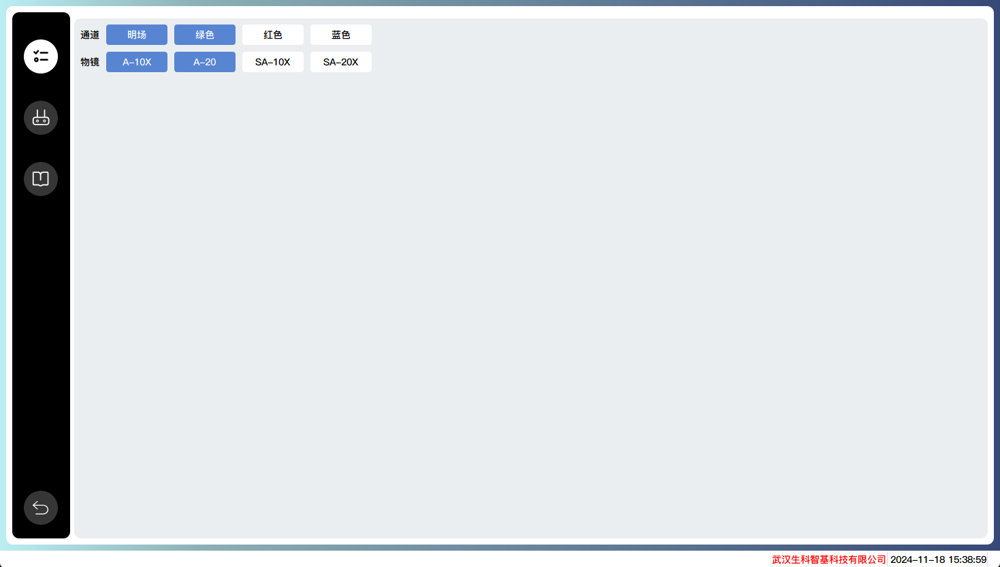
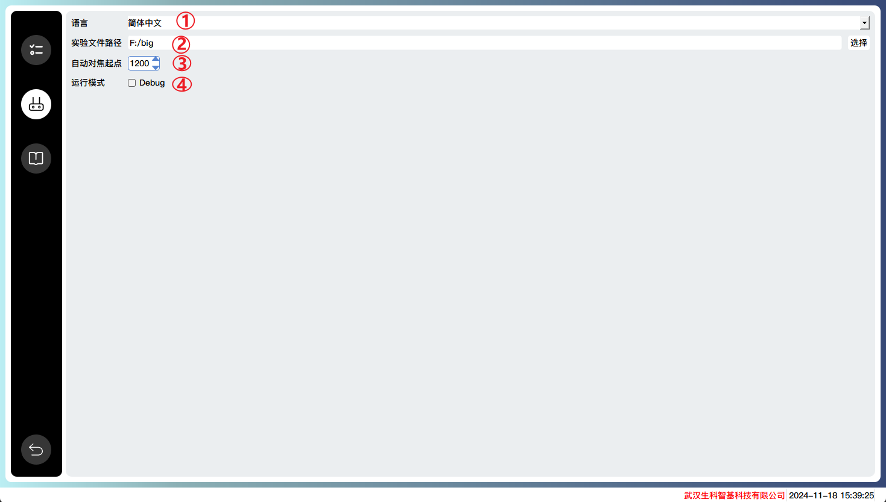
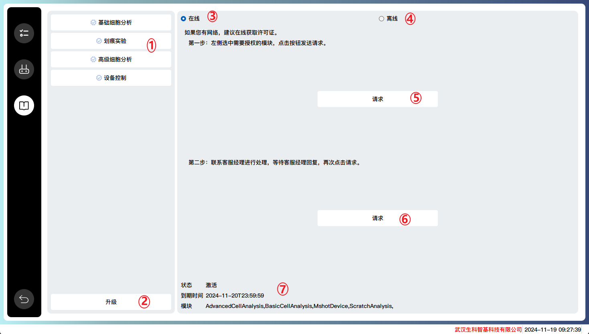

# Application settings

## Device settings
Configure the functions according to the specific microscope equipment model.

## System settings

1. Supports both Chinese and English languages, takes effect after restarting the software
2. The default storage path for experimental files. If any modifications are made, move the experimental files from the original directory to the new directory.
3. Set the starting point for autofocus

## Module settings
Module introduction and module authorization.

1. Module Introduction
2. Module upgrade page
3. Online application method
4. Offline application method
5. Select the left module and click the button to send the application request
6. After waiting for a reply, click on the request again
7. Display authorization information

For more detailed information, please refer to the installation and activation section.