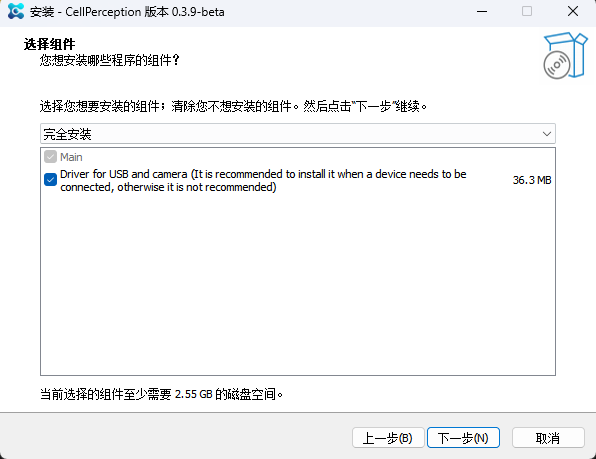

# Installation & Activation
This chapter mainly introduces how to install software and activate modules.

## Installation

### Installation package

The installation package contains 3 files, usually 2-3GB in size, as shown in the following figure.

### Select installation package language

### license agreement

### Installation Path
Recommended installation in English path, can be installed on other drive letters.

### Component Selection

If a microscope device needs to be connected, the following driver components must be selected. Otherwise, there is no need to check the driver component.

### Preparing for installation

### installation progress

### driver installation

If the driver component has been selected earlier, a dialog box related to driver installation will pop up during the installation process. Click on the red circle area below to complete the driver installation. If there is a prompt indicating installation failure, please contact the system supplier.

### Installation completion

The installation process is now complete. Click Finish to enter the main interface of the software.

## Module Activation

Newly installed software, by default, most modules are unusable, so an activation process is required before they can be used.

Some modules are free, while others are paid modules.

### Online Activation
Suitable for online application when there is an internet connection.

1. Select the modules that require authorization
2. Click to enter the upgrade page
3. Choose an online application method
4. Click on the request and contact customer experience for processing.
5. After waiting for the customer service manager's reply, click on the request again.
6. Authorized modules, expiration dates, and other related information.

### Offline Activation
Suitable for online application without internet connection.

1. Select the modules that require authorization
2. Click to enter the upgrade page
3. Choose offline application method
4. Click on export registration file and send the file to the account manager.
5. Wait for the customer service manager to reply with another activation code file, and click to import the file.
6. Authorized modules, expiration dates, and other related information.